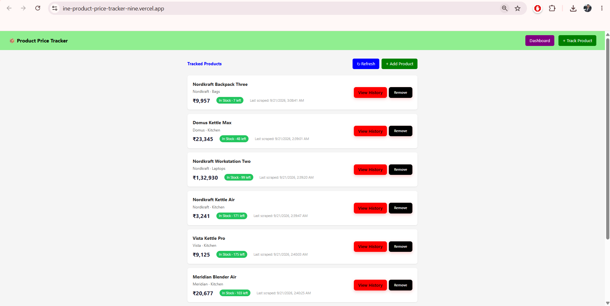
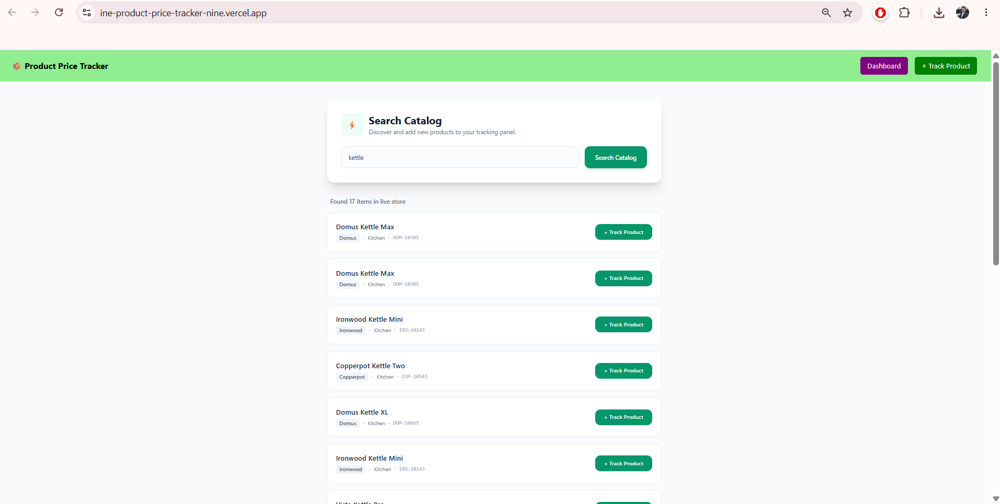
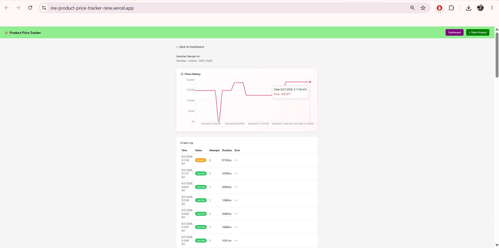
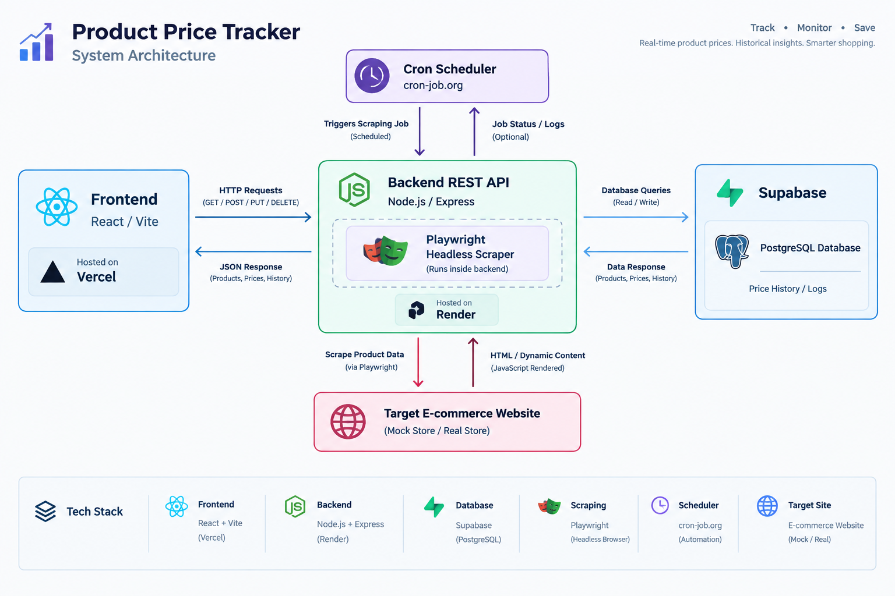

# 🚀 Product Price Tracker

> A modern, full-stack automated e-commerce price monitoring and analytics platform designed to track real-time product prices, stock availability, and historical trends with zero friction.

[](https://ine-product-price-tracker-nine.vercel.app)
[](https://github.com/krishna2720/ine-product-price-tracker)
[](https://opensource.org/licenses/MIT)

---

### 🛠️ Tech Stack Badges

[](https://reactjs.org/)
[](https://nodejs.org/)
[](https://expressjs.com/)
[](https://supabase.com/)
[](https://render.com/)
[](https://vercel.com/)


## 📸 Screenshots

### 🖥️ Dashboard View
*Overview of actively monitored products with real-time pricing, stock status, and quick-action buttons.*


### 🔍 Product Search & Discovery
*Real-time catalog searching and instant filtering by name, brand, or category.*


### 📈 Price History & Logs Analytics
*Interactive timeline charts displaying historical price fluctuations and deep scrape execution logs.*



## 🎯 Why This Project?

Manual price tracking across e-commerce stores is tedious, time-consuming, and prone to missing crucial price drops or stock changes. This project solves the problem by automating the entire lifecycle—from scraping live catalog data and storing historical trends to providing instant visual analytics—ensuring users never miss a deal or inventory update.

## 🌟 Key Features

* **🔍 Smart Catalog Search:** Instantly discover and filter items from the live store catalog using partial or full name/category matching.
* **📦 Dynamic Product Tracking:** Seamlessly add desired products to your tracking panel with real-time sync and status indicators.
* **💰 Real-Time Price Monitoring:** Keep tabs on current product pricing and inventory stock levels (`In Stock` / `Out of Stock`) at a glance.
* **📈 Interactive Price History Visualization:** Track price fluctuations over time through clean timeline graphs for any selected product.
* **🕷️ Automated Web Scraping:** Robust backend scraper that extracts live product data, pricing, and stock changes on demand.
* **⏰ Automated Cron Scheduling:** Background automation via `node-cron` to execute scheduled scraping tasks (every 2 hours) ensuring data is always fresh.
* **📊 Comprehensive Scrape Logs:** Detailed monitoring history for every product tracking attempt (success status, attempt counts, execution duration, and error diagnostics).
* **🗄️ Persistent PostgreSQL Storage:** Reliable relational database management powered by Supabase for secure data retention.
* **⚡ Robust REST API:** Clean Express.js backend endpoints handling product synchronization, tracking actions, and history retrieval.
* **🛡️ Resilient Error Handling:** Graceful failure management and error logging across both frontend UI states and backend server operations.

## 📐 Architecture & System Flow

The application follows a modern decoupled full-stack architecture where the React frontend, Node.js/Express backend, and Supabase PostgreSQL database operate independently across cloud deployment environments.

### 🔄 Data & Scraping Flow

1. **Trigger Source:** User triggers manual refresh (`POST /scrape/run`), cron schedule (`node-cron`), or tracking action.
2. **Backend Execution:** Express.js backend initiates the scraping service to parse live product info from the target store catalog.
3. **Data Normalization:** Scraped data (prices, stock counts, timestamps) is processed and structured.
4. **Database Persistence:** Validated records and historical data logs are securely committed to **Supabase PostgreSQL**.
5. **UI Synchronization:** React frontend fetches updated records via REST API endpoints and instantly renders real-time dashboards, charts, and logs.

## ⚙️ How It Works

1. **Catalog Discovery & Searching:** 
   - Users navigate to the "+ Track Product" section where they can perform real-time partial or full catalog searches.
   - Upon clicking **"+ Track Product"**, the item instantly transitions to a tracked state (`✓ Tracked`) and registers in the active database panel.

2. **Real-Time Price & Stock Tracking:**
   - The main dashboard lists all actively monitored products, showcasing their latest live pricing, remaining stock counts, and precise timestamps of the last scrape execution.

3. **Data Refresh & Scraping Mechanisms:**
   - **Manual Refresh:** Clicking the **"Refresh"** button on the UI triggers a backend `POST /scrape/run` request, fetching the newest data before reloading the dashboard UI.
   - **Automated Scraping:** Background automation via `node-cron` periodically hits the scraping routine (every 2 hours) to keep market pricing up to date without manual intervention.
   - **API Testing:** Endpoints like `/products` and `/products/:id/history` can also be directly queried or tested via external tools like Postman or REST clients.

4. **Analytics & Historical Tracking:**
   - Users can click **"View History"** on any product card to access deep insights.
   - This routes to a dedicated analytical view displaying an interactive price history timeline graph alongside comprehensive **Scrape Logs** (detailing execution status, attempt counts, duration in milliseconds, and error diagnostics).

5. **Data Cleanup:**
   - If a product is no longer of interest, users can easily click the **"Remove"** button to delete it from the tracked database pool instantly.

## 🛠️ Tech Stack

### 🖥️ Frontend
* **React** – Component-based UI library for building the interactive dashboard.
* **Vite** – Next-generation lightning-fast frontend build tool and bundler.
* **JavaScript** – Core programming language for client-side logic.
* **CSS** – Styling for responsive, clean layouts and card components.

### ⚙️ Backend
* **Node.js** – JavaScript runtime environment for server-side execution.
* **Express.js** – Fast, minimalist web framework for managing server logic.
* **REST APIs** – Structured endpoints for client-server communication and data sync.

### 🗄️ Database
* **PostgreSQL** – Powerful, scalable relational database for persistent storage.
* **Supabase** – Backend-as-a-service platform hosting and managing the PostgreSQL database.

### 🕷️ Scraping
* **Playwright** – Robust browser automation library for parsing live e-commerce data.
* **Chromium** – Headless browser engine powering automated data extraction.

### 🚀 Deployment & Automation
* **Vercel** – Cloud hosting platform for high-performance frontend deployment.
* **Render** – Cloud provider for hosting the Node.js/Express backend server.
* **cron-job.org** – External web cron scheduling service used to automate periodic backend scraping tasks.

## 📐 System Architecture

*High-level overview of the decoupled frontend, backend, database, and automated scraping pipeline.*




## 📁 Project Structure

```text
product-price-tracker/
│
├── backend/
│   ├── node_modules/           # Backend dependencies and node packages
│   ├── .env                    # Environment variables (Database credentials, API keys)
│   ├── .gitignore              # Files and directories ignored by Git version control
│   ├── db.js                   # Supabase PostgreSQL connection pool and database helper
│   ├── Dockerfile              # Container configuration file for backend deployment
│   ├── index.js                # Main Express application server and REST API route handlers
│   ├── package.json            # Backend package configuration, dependencies, and start scripts
│   ├── package-lock.json       # Exact locked versions of backend dependencies
│   ├── rough.txt               # Scratchpad file for development notes and testing logic
│   ├── run-scraper.js          # Standalone execution script to trigger scraping routines manually
│   ├── scraper.js              # Core web scraper logic using Playwright and Chromium
│   └── test-db.js              # Diagnostic script to test and verify database connectivity
│
├── frontend/
│   ├── node_modules/           # Frontend dependencies and node packages
│   ├── src/
│   │   ├── components/
│   │   │   └── Navbar.jsx      # Global navigation bar component for page routing
│   │   ├── pages/
│   │   │   ├── Dashboard.jsx   # Main tracking view showing live prices, refresh, and remove actions
│   │   │   ├── ProductDetail.jsx # Detailed view featuring price history charts and scrape logs
│   │   │   └── Search.jsx      # Catalog search view with partial/full query filtering & tracking toggle
│   │   ├── App.css             # Custom styles and global utility declarations
│   │   ├── App.jsx             # Root React component managing application routes and layout structure
│   │   ├── index.css           # Tailwind CSS directives and global base styles
│   │   └── main.jsx            # React entry point mounting the app to the DOM
│   │
│   ├── .env                    # Frontend environment configuration (Backend API base URL)
│   ├── .gitignore              # Files and directories ignored by Git for frontend
│   ├── eslint.config.js        # ESLint configuration for code quality and formatting rules
│   ├── index.html              # HTML root template containing the mounting element
│   ├── package.json            # Frontend package configuration and Vite build scripts
│   ├── package-lock.json       # Locked dependency versions for frontend reproducible builds
│   ├── postcss.config.js       # PostCSS processor configuration for Tailwind CSS
│   ├── tailwind.config.js      # Tailwind CSS design system configuration and theme options
│   └── vite.config.js          # Vite build tool and development server configuration
│
└── README.md                   # Main project documentation and system architecture guide
```

## 🚀 Installation & Setup

To run this project locally for development or review, follow these simple steps to set up both the backend server and the frontend client.

### Prerequisites
Make sure you have the following installed on your machine:
* [Node.js](https://nodejs.org/) (v18+ recommended)
* npm (Node Package Manager)
* Supabase Account & PostgreSQL Database

---

### 1. Clone the Repository
```bash
git clone https://github.com/krishna2720/ine-product-price-tracker.git
cd product-price-tracker
```

---

### 2. Backend Setup
Navigate into the backend directory, install dependencies, configure environment variables, and start the server:

```bash
# Move to backend folder
cd backend

# Install required dependencies
npm install

# Create a .env file and add your credentials (Supabase URL,SUPABASE_SERVICE_ROLE_KEY,  Port, etc.)
# Example:
# PORT=5000
# SUPABASE_URL=your_supabase_url
# SUPABASE_KEY=your_supabase_key

# Start the Express backend server
npm run dev
```
*(The backend server will typically run on `http://localhost:3000`)*

---

### 3. Frontend Setup
Open a new terminal window, navigate into the frontend directory, install dependencies, and start the Vite development server:

```bash
# Move to frontend folder from root
cd frontend

# Install required dependencies
npm install

# Create a .env file for frontend API configuration
# Example:
# VITE_API_BASE_URL=http://localhost:3000

# Start the Vite React development server
npm run dev
```
*(The frontend application will run on `http://localhost:5173`)*

## 🔐 Environment Variables

To run this project successfully, you need to configure environment files (`.env`) for both the `backend` and `frontend` directories. Create a `.env` file in each respective folder based on the templates below.

### ⚙️ Backend Environment Variables (`backend/.env`)

Create a `.env` file inside the `backend/` directory with the following keys:

```env
# Server Configuration
PORT=5000

# Supabase Database Credentials
SUPABASE_URL=your_supabase_project_url
SUPABASE_SERVICE_ROLE_KEY=your_supabase_service_role_key

# Optional: Scraping configuration or cron tokens if applicable
```

### 🖥️ Frontend Environment Variables (`frontend/.env`)

Create a `.env` file inside the `frontend/` directory with the following keys:

```env
# Backend API Base URL
VITE_API_BASE_URL=http://localhost:3000
```
## 🕷️ Scraping Approach

Instead of using a basic HTTP `fetch` or static HTML parser (like Cheerio), **Playwright with Chromium** was intentionally chosen because the target e-commerce store is a JavaScript-rendered Single Page Application (SPA). A standard fetch request would only pull empty template shells before content hydration, whereas Playwright spins up a headless browser instance to fully execute JavaScript and wait for network elements to render. The automation script locates product cards using resilient CSS selectors, navigates directly to individual product pages to extract deep details (like price points and stock inventory), and rigorously validates the parsed payload before committing it to the database, ensuring clean data ingestion and zero corruption.

## 🗄️ Database Design

The project uses **Supabase (PostgreSQL)** as a robust, relational database to securely store products, historical pricing trends, and system execution logs. 

### Core Tables & Schema Structure

1. **`products` Table** (Stores catalog items and current tracking state)
   - `id` (SERIAL / PRIMARY KEY): Unique identifier for each product.
   - `title` (VARCHAR): Name of the product.
   - `url` (TEXT): Direct e-commerce store link for scraping.
   - `current_price` (DECIMAL): Latest detected price point.
   - `stock_status` (VARCHAR): Live inventory status (`In Stock` / `Out of Stock`).
   - `is_tracked` (BOOLEAN): Flag indicating whether the item is actively monitored.
   - `created_at` (TIMESTAMP): Record creation timestamp.

2. **`price_history` Table** (Stores time-series price data for charts)
   - `id` (SERIAL / PRIMARY KEY): Unique log identifier.
   - `product_id` (INTEGER / FOREIGN KEY -> `products.id`): References the parent product.
   - `price` (DECIMAL): Recorded price at the specific timestamp.
   - `recorded_at` (TIMESTAMP): Exact time the price check was performed.

3. **`scrape_logs` Table** (Tracks automation execution health)
   - `id` (SERIAL / PRIMARY KEY): Log identifier.
   - `status` (VARCHAR): Execution outcome (`SUCCESS` / `FAILED`).
   - `attempt_count` (INTEGER): Number of retries or fetch cycles.
   - `duration_ms` (INTEGER): Total time taken to complete the scrape cycle in milliseconds.
   - `error_message` (TEXT): Diagnostic details if an error occurred.
   - `executed_at` (TIMESTAMP): Timestamp of the scraping run.
## 🔌 API Documentation

The Node.js/Express backend provides a clean RESTful API for managing tracked products, viewing historical trends, and triggering automated scraper routines.

| Endpoint | Method | Description | Request Parameters / Payload |
| :--- | :--- | :--- | :--- |
| `/health` | `GET` | Server health check endpoint returning system status and current timestamp. | None |
| `/` | `GET` | Root welcome endpoint confirming server runtime status. | None |
| `/search` | `GET` | Queries the external catalog API to search and filter products by name, brand, or category. | Query Param: `?q=product_name` |
| `/products` | `GET` | Retrieves a list of all actively tracked products from the database. | None |
| `/products` | `POST` | Registers a new product into the tracking system database pool. | JSON Body: Product configuration object |
| `/products/:id` | `DELETE` | Removes a tracked product and its associated logs from the database by ID. | URL Param: `id` |
| `/products/:id/history` | `GET` | Fetches price history snapshots for a specific product ID. | URL Param: `id` |
| `/products/:id/logs` | `GET` | Retrieves deep scraping execution logs and diagnostics for a specific product ID. | URL Param: `id` |
| `/scrape/run` | `POST` | Manually triggers the Playwright scraping service across all tracked products. | None |


## 🚀 Deployment

The project follows a decoupled, production-ready architecture across reliable cloud platforms:

* **Frontend:** Deployed on **Vercel** — [Live Demo](https://ine-product-price-tracker-nine.vercel.app/)
* **Backend:** Hosted on **Render** (Node.js & Express REST API)
* **Database:** Managed relational storage hosted on **Supabase** (PostgreSQL)
* **Scheduler:** Automated periodic polling triggered via **cron-job.org**
* **Scraper:** Headless browser automation engine powered by **Playwright & Chromium**

## 🧪 Testing & Verification

* **Scraper Testing:** Validated live against the target JavaScript-rendered SPA to ensure reliable DOM element selection and data parsing.
* **API & Database Validation:** Tested all Express REST endpoints locally and in production, verifying successful PostgreSQL insertions, price history logging, and cascading deletes.
* **Automation Check:** Verified end-to-end background execution by triggering scheduled scraping jobs via external web crons.

## 🧩 Challenges & Solutions

* **Dynamic SPA Rendering:** Standard HTTP fetches failed because the target store was JavaScript-rendered; resolved by integrating **Playwright with Chromium** to fully hydrate pages before element parsing.
* **Cron Timeout Limits:** Extended multi-product scraping runs caused HTTP timeout errors on the server; resolved by updating the backend endpoint to respond immediately and execute the scraping loop asynchronously in the background.

## 💡 What I Learned

* Built a robust full-stack scraping pipeline, mastering headless browser automation with Playwright for dynamic SPAs.
* Gained deep production experience in asynchronous background cron jobs, cloud database management, and decoupled deployments.

## 🚀 Future Improvements

* Implement intelligent price-drop email and Telegram alerts to notify users instantly when tracked product prices fall.
* Integrate multi-store e-commerce support with dynamic proxy rotation to bypass rate limits and scale monitoring.

## 👨‍💻 Author

**Krishna Agarwal**  
B.Tech CSE — JIIT Noida  

* **Email:** [krishna.125766@gmail.com](mailto:krishna.125766@gmail.com)
* **GitHub:** [github.com/krishna2720](https://github.com/krishna2720)
* **LinkedIn:** [linkedin.com/in/krishna-agarwal-a6a518321](https://www.linkedin.com/in/krishna-agarwal-a6a518321/)
* **Codolio:** [codolio.com/profile/krish_27](https://codolio.com/profile/krish_27)